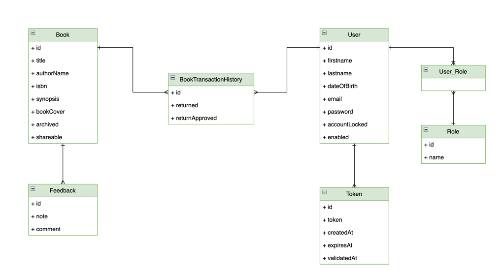
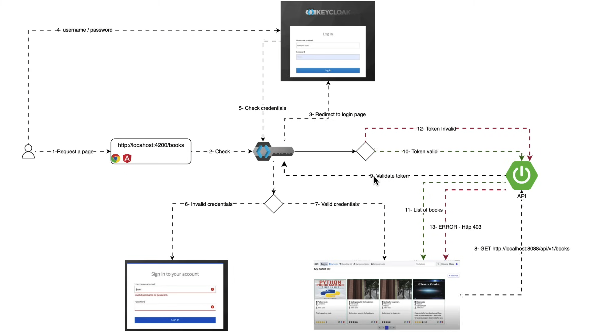
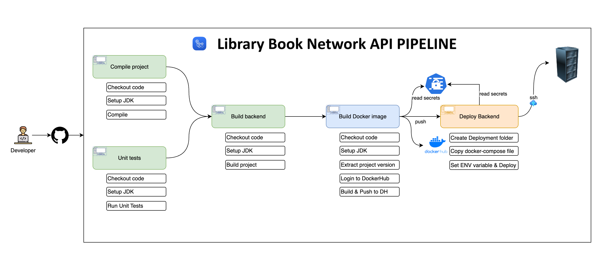
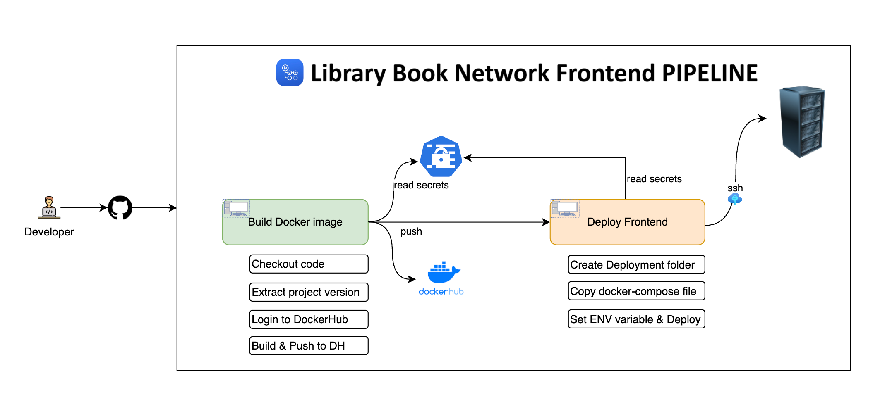

# library-book-network-keycloak-app

- Migrating my own last project "library-book-network" which had jwt based auth, to integrating it with Keycloak as OAuth2.
- Start your docker-desktop and run docker-compose.yml file first. It'll start PostgreSQL-Server first, then pgadmin, and then Keycloak-Server at localhost.
- Provide respective passwords - `admin` for pgadmin, and `password123` for postgresql-db.
- Go to => http://localhost:9000 and Configure your keycloak settings. Here credentials are `admin/admin`.
- Create realm as 'library-book-network', and create your client.
  
- Then run the springboot backend program from IDE.
- Now you have to install node_package Angular folder with `npm install` first to install dependencies packages, then run frontend with `mpm start`
- And hit the browser => http://localhost:4200

## Table of Contents

- [Overview](https://github.com/AadityaUoHyd/library-book-network-keycloak-app/tree/master/library-book-network-keycloack-app#overview)
- [Features](https://github.com/AadityaUoHyd/library-book-network-keycloak-app/tree/master/library-book-network-keycloack-app#features)
- [Technologies Used](https://github.com/AadityaUoHyd/library-book-network-keycloak-app/tree/master/library-book-network-keycloack-app#technologies-used)
    - [Backend (library-book-network-backend)](https://github.com/AadityaUoHyd/library-book-network-keycloak-app/tree/master/library-book-network-keycloack-app#library-book-network-backend)
    - [Frontend (library-book-network-frontend)](https://github.com/AadityaUoHyd/library-book-network-keycloak-app/tree/master/library-book-network-keycloack-app#library-book-network-frontend)
- [Learning Objectives](https://github.com/AadityaUoHyd/library-book-network-keycloak-app/tree/master/library-book-network-keycloack-app#learning-objectives)
- [Getting Started](https://github.com/AadityaUoHyd/library-book-network-keycloak-app/tree/master/library-book-network-keycloack-app#getting-started)

## Overview

Library Book Network is a full-stack application that enables users to manage their book collections and engage with a community of book enthusiasts. It offers features such as user registration, secure email validation, book management (including creation, updating, sharing, and archiving), book borrowing with checks for availability, book return functionality, and approval of book returns. The application ensures security using JWT tokens and adheres to best practices in REST API design. The backend is built with Spring Boot 3 and Spring Security 6, while the frontend is developed using Angular with Bootstrap for styling.

## Features

- User Registration: Users can register for a new account.
- Email Validation: Accounts are activated using secure email validation codes.
- User Authentication: Existing users can log in to their accounts securely.
- Book Management: Users can create, update, share, and archive their books.
- Book Borrowing: Implements necessary checks to determine if a book is borrowable.
- Book Returning: Users can return borrowed books.
- Book Return Approval: Functionality to approve book returns.

#### Class diagram

#### Spring security diagram

#### Backend Pipeline

#### Frontend Pipeline

## Technologies Used

### Backend (library-book-network-backend)

- Spring Boot 3
- Spring Security 6
- Authentication using Keycloak (OpenID)
- Spring Data JPA
- JSR-303 and Spring Validation
- OpenAPI and Swagger UI Documentation
- Docker

### Frontend (library-book-network-frontend)

- Angular
- Component-Based Architecture
- Lazy Loading
- Authentication Guard
- Keycloak-js
- OpenAPI Generator for Angular
- Bootstrap

## Learning Objectives

By building this project, one can learn:

- Designing a class diagram from business requirements
- Implementing a mono repo approach
- Securing an application using Keycloak with Spring Security
- Registering users and validating accounts via email
- Utilizing inheritance with Spring Data JPA
- Implementing the service layer and handling application exceptions
- Object validation using JSR-303 and Spring Validation
- Handling custom exceptions
- Implementing pagination and REST API best practices
- Using Spring Profiles for environment-specific configurations
- Documenting APIs using OpenAPI and Swagger UI
- Implementing business requirements and handling business exceptions
- Dockerizing the infrastructure

## Getting Started

To get started with the Library Book Network project, follow the setup instructions in the respective directories:

- [Backend Setup Instructions](https://github.com/AadityaUoHyd/library-book-network-keycloak-app/tree/master/library-book-network-keycloack-app/library-book-network-backend#readme)
- [Frontend Setup Instructions](https://github.com/AadityaUoHyd/library-book-network-keycloak-app/tree/master/library-book-network-keycloack-app/library-book-network-frontend#readme)
